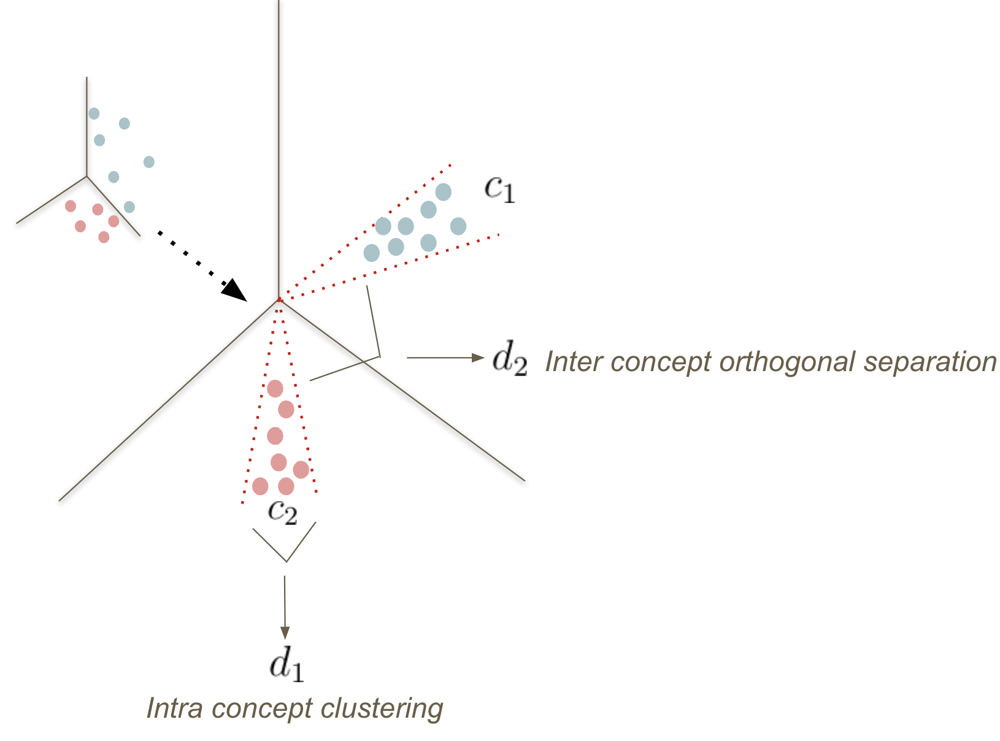

# coop-cbm
Repository for Neurips 2023 paper - Auxiliary Losses for Learning Generalizable Concept-based Model

# Auxiliary Losses for Learning Generalizable Concept-based Model

This repo provides code for our Neurips 2023 paper - Auxiliary Losses for Learning Generalizable Concept-based Model. 

[Ivaxi Sheth](https://ivaxi0s.github.io/), [Samira Ebrahimi Kahou](https://saebrahimi.github.io/)

**Motivation**

While CBMs present benefits with models’ explainability, some works have shown that concept representations of CBM may result in information leakage that deteriorates predictive performance. It is also noted that CBM may not lead to semantically explainable concep. Such
bottlenecks may result in ineffective predictions that could prevent the use of CBMs in the wild.


**Coop-CBM + Concept Orthogonal Loss**
In this work, we propose cooperative-CBM (coop-CBM) model aimed at addressing the performance
gap between CBMs and standard black-box models. Coop-CBM uses an auxiliary loss that facilitates
the learning of a rich and expressive concept representation for downstream task. To obtain orthogonal
and disentangled concept representation, we also propose concept orthogonal loss (COL). COL can
be applied during training for any concept-based model to improve their concept accuracy. 
We perform an extensive evaluation of the generalisation capabilities of CBMs on three
different distribution shifts.





**Usage**

In comparision to many CBM works, we all all of the concepts for CUB. To run the models for coop-CBM with COL, run the following command:

```
python experiments.py Coop -log_dir Coop/outputs/ -e 1000 -optimizer sgd -pretrained -use_aux -use_attr -n_attributes $N_ATTR -attr_loss_weight $ATTR_W -normalize_loss -b 64 -weight_decay $WD -lr $LR -scheduler_step 20 -dset $DATASET -data_dir $DATA_DIR
 ```

The synthetic dataset generation can be found in `src.data.gen_spurious`.

### Argument Parsing

The `parse_arguments` from `src.util.utils` function is designed to handle different experiment configurations. 

## Citation

If you find our work useful in your research, please consider citing:

```bibtex
@inproceedings{
sheth2023auxiliary,
title={Auxiliary Losses for Learning Generalizable Concept-based Models},
author={Ivaxi Sheth and Samira Ebrahimi Kahou},
booktitle={Thirty-seventh Conference on Neural Information Processing Systems},
year={2023},
url={https://openreview.net/forum?id=jvYXln6Gzn}
}
```